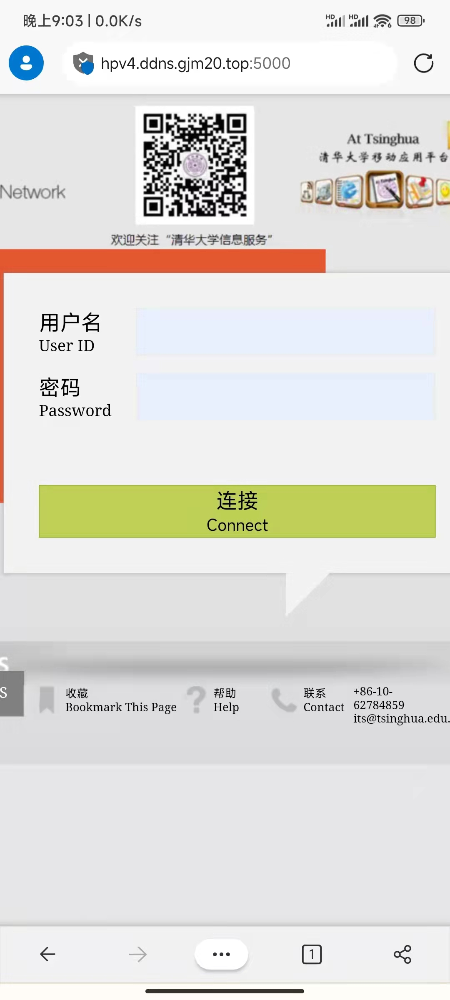

# 作业 2 报告

## 效果呈现

电脑端效果：


手机端效果：




## 使用说明

### 测试账号与API

内置两个账号`alice`、`bob`，密码和账号名相同，若在测试过程中发现已用流量数值过大，可以访问 https://hw2-websummer.gjm20.top/api/reset 来重置流量记录


### 快速访问

使用浏览器打开 https://hw2-websummer.gjm20.top，即可查看效果。

注：因为是使用自己的服务器托管的，是一个5Mbps的小水管，加载速度可能较慢。


### 从源码构建

本项目使用到的框架：

* `Nuxt3`：基于Vue3的框架，能自动完成SSR、路由等一系列繁琐但重要的功能
* `Voca.js`：JS 中的字符串格式化
* `sass`：让写CSS的血压稍稍降低
* `flask`：后端框架
* `eventlet`：支持高并发的 WSGI 容器


本项目使用到的图标资源：具体图标来源见源码注释

* Awesome Font
* Bootstrap Font


使用`yarn`进行包管理，使用`npm`会遇到一些奇怪的依赖问题，下面先安装各种依赖：

```bash
git clone https://github.com/GJCav/thu-summerweb.git
cd thu-summerweb
git checkout homework2
yarn install

pip3 install -r requirements.txt
```


因为要处理 CORS，作业2的部署有些麻烦，可有如下两种部署方式：

* Flask 处理静态资源：步骤较少，但vue3-router会有一些奇怪的行为(*)
* 完整部署：完整的生产级别服务器部署方案，比较繁琐

(*) 如果直接访问`/success`会返回404，但从`/`内部点连接到`/success`则能够正确渲染网页，这个bug源于vue3 router的限制。


**Flask 处理静态资源**

```bash
yarn generate
export STATIC_HOST=1    # $env:STATIC_HOST=1     ,if using powershell
export FLASK_PORT=3000  # $env:FLASK_PORT=3000
python3 server.py
```

然后打开浏览器 http://127.0.0.1:3000/


**完整部署**

* 安装`nginx`，使用项目中`nginx.conf`的配置，起到反向代理的作用，避免 CORS

  ```nginx
  server {
      listen 5000;
      server_name localhost;
  
      location / {
          proxy_pass http://localhost:3000/; # node 服务器地址
      }
  
      location /api/ {
          proxy_pass http://localhost:3001;  # python 服务器地址
      }
  }
  ```

  然后启动 nginx 服务

* 启动 node 服务器：

  ```bash
  yarn build
  export NITRO_PORT=3000
  node .output/server/index.mjs
  ```

* 启动 flask 服务器

  ```shell
  export FLASK_PORT=3001
  python3 server.py
  ```

如果部署无误，现在打开浏览器 http://127.0.0.1:5000/ 就能看到网页了。


## 困难与解决

### 纯CSS实现界面工作量太大

所以本次作业的登陆界面直接使用大量图片来完成UI界面，优点是写起来确实快了，缺点是灵活性低、不能直接通过纯CSS方案实现配色切换。此外，直接切图、贴图的方法不利于多端适配，实际测试在手机上无法显示该登录页左侧内容，如果使用响应式布局方案则可非常方便的适配手机端。

现阶段已经有许多成熟的响应式布局CSS框架，例如 Bootstrap、Tailwind CSS等，但风格和`net.tsinghua.edu.cn`相差很大，所以本次作业没有使用这些框架。


### 登陆状态管理

状态管理代码集中在`composables/useUserAciton.ts`文件中，还包括登陆、登出、从服务器下载用户档案等功能，网页运行期间有且只有一份状态，避免混乱


