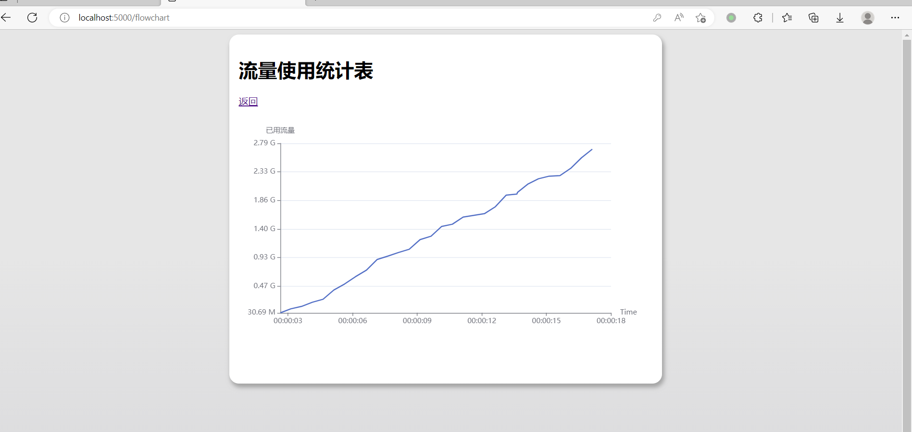
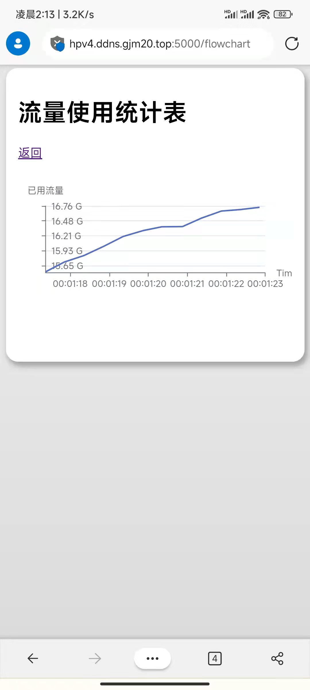

# 作业 2 报告

## 效果呈现

电脑端效果：




手机端效果：




## 使用说明

### 测试账号与API

内置两个账号`alice`、`bob`，密码和账号名相同，若在测试过程中发现已用流量数值过大，可以访问 https://hw3-websummer.gjm20.top/api/reset 来重置流量记录


### 快速访问

使用浏览器打开 https://hw3-websummer.gjm20.top 登陆，然后在登陆成功页面可以看到一个“查看流量表”的超链接，点击即可。

注：使用自己的服务器托管，是一个5Mbps的小水管，加载速度可能较慢。


### 与作业要求不一致特别说明

作业中对数据更新行为作出了非常明确的要求，但效果较差，所以作出下列修改：

* 为了缩短等待时间，折线图每 500ms 更新一次
* 折线图显示最近30个时刻的使用情况，数据点间距不固定的2s，而是由服务器记录的实际连接时长

若需修改上述效果，可打开`pages/flowchart.vue`，找到如下几行进行修改：

```typescript
const interval = 500; // 数据更新间隔时间
const dataLen = 30;   // 显示数据点个数
```


### 从源码构建

本项目使用到的框架：

* `Nuxt3`：基于Vue3的框架，能自动完成SSR、路由等一系列繁琐但重要的功能
* `Voca.js`：JS 中的字符串格式化
* `sass`：让写CSS的血压稍稍降低
* `flask`：后端框架
* `eventlet`：支持高并发的 WSGI 容器
* `echarts`：绘图库


本项目使用到的图标资源：具体图标来源见源码注释

* Awesome Font
* Bootstrap Font


使用`yarn`进行包管理，使用`npm`会遇到一些奇怪的依赖问题，下面先安装各种依赖：

```bash
git clone https://github.com/GJCav/thu-summerweb.git
cd thu-summerweb
git checkout homework3
yarn install

pip3 install -r requirements.txt
```


因为要处理 CORS，作业2的部署有些麻烦，可有如下两种部署方式：

* Flask 处理静态资源：步骤较少，但vue3-router会有一些奇怪的行为(*)
* 完整部署：完整的生产级别服务器部署方案，比较繁琐

(*) 如果直接访问`/success`会返回404，但从`/`内部点链接到`/success`则能够正确渲染网页，这个bug源于vue3 router的限制。


**Flask 处理静态资源**

```bash
yarn generate
export STATIC_HOST=1    # $env:STATIC_HOST=1     ,if using powershell
export FLASK_PORT=3000  # $env:FLASK_PORT=3000
python3 server.py
```

然后打开浏览器 http://127.0.0.1:3000/


**完整部署**

* 安装`nginx`，使用项目中`nginx.conf`的配置，起到反向代理的作用，避免 CORS

  ```nginx
  server {
      listen 5000;
      server_name localhost;
  
      location / {
          proxy_pass http://localhost:3000/; # node 服务器地址
      }
  
      location /api/ {
          proxy_pass http://localhost:3001;  # python 服务器地址
      }
  }
  ```

  然后启动 nginx 服务

* 启动 node 服务器：

  ```bash
  yarn build
  export NITRO_PORT=3000
  node .output/server/index.mjs
  ```

* 启动 flask 服务器

  ```shell
  export FLASK_PORT=3001
  python3 server.py
  ```

如果部署无误，现在打开浏览器 http://127.0.0.1:5000/ 就能看到网页了。


## 困难与解决

### 适配不同设备

**问题一**

需求：对于宽屏幕：水平居中显示；对于窄屏幕，全宽度显示

解决：scss代码核心如下：

```scss
.container{
  width: 100%;

  box-sizing: border-box;

  @media screen and (min-width: 720px) {
    width: 720px;
    margin-left: auto;
    margin-right: auto;
  }
}
```


**问题二**

问题：vue 挂载时，DOM还未渲染完成，需要一个合适的时机将echart加载到页面上

解决：DOM ref，保证DOM Element 不为 null

```html
<template>
<div ref="chartDomRef" class="chart"></div>
</template>

<script setup>
const chartDomRef = ref(null);
//...
myChart = echarts.init(chartDomRef.value);
</script>
```


**问题三**

echart 绘制区域跟随窗口变化，同时在屏幕非常窄的时候将y轴标签内置，利用 window.onresize 事件：

```typescript
function resizeChart(){
  if(myChart != null){
    let width = chartDomRef.value.clientWidth;
    let height = width * 0.6;
    myChart.resize({width: width, height: height})
    if(width < 400){
      myChart.setOption({
        yAxis:{
          axisLabel:{
            inside: true
          }
        }
      })
    }else{
      myChart.setOption({
        yAxis:{
          axisLabel:{
            inside: false
          }
        }
      })
    }
  }
}

window.onresize = resizeChart
```
